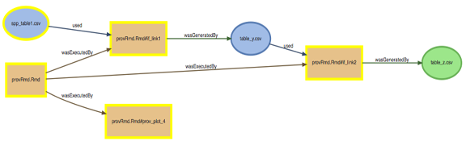

# Intro to provenance

The Ocean Health Index strives toward the ideals of open science: access, transparency, reproducibility, and repeatability.  In our global assessment and regional assessments, we have increasingly been using R Markdown to document our work flow, data preparation, and score calculation, while using GitHub as a version control system as well as a means of making our work freely accessible.

One important aspect of reproducibility is the ability to follow data from raw sources to finished product, be it a graph, a calculation, a synthesized dataset, or an OHI score.  GitHub affords a limited ability to track the creation and modification of datasets, scripts, figures, and documents, but as multiple sources are combined, it may be impossible to pick apart which version of dataset A was used by which version of script B to create figure C and output data D.  This becomes even further complicated by the fact that differences in versions of base software, packages, and systems can create minor or major differences in the outcomes.

The `provRmd` package attempts to capture the necessary information to exactly reproduce the results of each specific run of an R Markdown script, by tracing data as they are brought into the parent Rmd, processed in code chunks or sourced scripts, and written out as intermediate or final products.

The `provRmd` package captures two types of provenance at once:

* Runtime provenance is a tracing of a specific run of a script, capturing versions and conditions to enable reproducibility of the results of that particular run.  This includes version tracking of input data files, scripts, output files, packages, software, and operating system.
* Workflow provenance is a conceptual understanding of the process, similar to a flow chart.  Which files were used by which scripts or code chunks, and which outputs were generated.



# How does `provRmd` work

Each time an R Markdown document is knit, `provRmd` collects information on each input, output, and script file to tie it to its most recent Git commit.  At the end of the knit, this sequence of filenames with their associated Git commit information are wrapped up with information about the system and session in which the R Markdown doc was knit.  This provenance log is saved to a .csv, and can be displayed directly in the knitted document, e.g. as a flow chart or a data table.

By recreating the conditions of a particular run, it should be reasonably simple to replicate the output or process.

Note that `provRmd` only works within the context of knitting an R Markdown document.  

# Using `provRmd`

The `provRmd` package is set up to be very simple to use within an existing R Markdown script.  ***tl;dr version***:

* In an early code chunk:
    * `library(provRmd)` to load the package.
    * `prov_setup()` to initialize the provenance tracking.
* Some regular code chunks that do cool stuff with your awesome data.
    * masked read/write functions will collect Git commit info and file info on your read/written data.
* At the end of the R Markdown script:
    * option 2 (basic): use `prov_wrapup()` to include an R Markdown footer; this function creates a provenance log and then renders provenance information into an optional summary (system and session info), workflow (diagram showing the basic steps of the analysis), and/or table (tabular file-by-file info on provenance)
    * option 3 (hard core): design your own custom footer using standalone calls to `script_prov()` and `plot_prov()`

## Setting up provenance tracking

The first step in using `provRmd` is to initialize the global variables that will track the process as the Rmd knits.  The `prov_setup()` function performs this, and should be called early in the R Markdown document, before any important files are read or sourced.  If you are using packages with read/write capabilities (e.g. `readr`), it is helpful to load `provRmd` afterward so the automatic provenance tracking masks the basic definition.

``` {r setup, echo = TRUE, warning = FALSE, message = FALSE}
knitr::opts_chunk$set(fig.width = 6, fig.height = 4, fig.path = 'Figs/',
                      echo = TRUE, message = FALSE, warning = FALSE)

library(tidyverse)

library(provRmd)

prov_setup() ### Initialize provenance tracking
```

## Capturing provenance of inputs, outputs, and scripts

As the knitting process proceeds, each time one of the registered functions is used to read or write data, e.g. `read.csv()` or `writeOGR()`, that function will be performed as normal but then will follow up with an embedded call to `git_prov()`, which uses the file name to query the latest Git commit information.  If no Git information is available (e.g. the file has never been committed, or the file exists outside the current Git repository) then the file will be logged with NAs instead.  

As the script runs, file provenance info is stored in a separate environment (`.provEnv`, the `.` keeps it hidden so it doesn't clutter up your workspace).  Here we use the built-in `iris` dataset to create a new .csv file that will be used as an input for later chunks. The `git_prov()` info will be stored in that hidden environment until it's needed later.

``` {r git_prov example}

iris_df <- iris %>%
  mutate(Petal.Area = Petal.Length * Petal.Width) ### yeah, they're not square petals... whatever!

write_csv(iris_df, 'iris_table1.csv')

iris_df <- iris_df %>%
  group_by(Species) %>%
  mutate(Aspect.Ratio = Petal.Length / Petal.Width,
         Skinny.Petal = Aspect.Ratio > mean(Aspect.Ratio))

write_csv(iris_df, 'iris_table2.csv')

```

### Using `git_prov()` manually

Note that `git_prov()` can be called manually, for example when calling a read/write function that is not in the `git_prov_fun` registry.  It may be useful as well to assign a particular file to various roles within the script, e.g. one code chunk creates an object and writes it as an output, and the next code chunk uses it as an input without calling a read function.  In that case, only the write function will be automatically logged.

Examples of these are given later in the vignette.

### Sourcing external scripts

When sourcing external scripts, `git_prov()` will capture provenance for the sourced script, and then associate inputs and outputs to that script, rather than to the parent.

``` {r git_prov source example}

### for knitting locally
# source('../inst/vignette_data/source_example.R')

### for knitting from package
source(system.file('vignette_data/source_example.R', package = 'provRmd'))

```

## Wrapping up provenance tracking

At the end of the R Markdown document, the `prov_wrapup()` function collects the sequence of information from all calls to `git_prov()`, attaches system information (from `Sys.info()`) and session information (from `sessionInfo()`), and writes out the log file to the prov directory within the working directory of the parent R Markdown document.  

In addition, `prov_wrapup()` can also generate a footer for your .Rmd with all the provenance info, as a table, as a summary, and/or as a workflow flow chart (by default, includes all these).  It can also (by default) automatically run a git commit to include any new or changed outputs.  (__NOTE: to display properly,__ the `prov_wrapup()` function must be called from within a code chunk with the `results = 'asis'` chunk option).

### Creating provenance workflow charts

``` {r plot_prov, echo = FALSE, message = FALSE, warning = FALSE}

script_prov()

plot_obj <- plot_prov(plot_dir = 'TB')

DiagrammeR::render_graph(plot_obj)
```

The output is a .svg with mouseover tooltips about the latest commit info for each script or file.  Red frames indicate files not currently tracked in Git; yellow frames indicate files whose contents have changed since the most recent Git commit.

# Good practices

## Naming code chunks

To gain the most granularity in the workflow provenance documentation of your R Markdown process, it is helpful to break up R code into small, meaningful chunks; each chunk might take in some inputs and create some outputs.  Since `provRmd` tracks each chunk separately, it is helpful to give each a short but meaningful name; unnamed chunks will default to `unnamed_chunk_1` and so on.

## Linking objects passed between code chunks

While R easily holds objects created in one chunk so they may be used in another chunk, this breaks the link of the flow of the data.  One way around this is to have each chunk write out its result object, for example using `write_csv()`, and then have the next chunk read the object back into memory, for example using `read_csv()`.  While this seems redundant, it makes sure that the object is registered as an output from one chunk and then as an input to the next.  

### Example of missed link:

Chunk 1 (called `broken_link_example1`)

``` {r broken_link_example1}
prov_setup() ### to reinitialize provenance tracking

x <- read_csv('iris_table1.csv')
y <- x %>%
  mutate(new_col = 'words')
write_csv(y, 'table_y.csv')
```

So far so good.  Then comes chunk 2 (called `broken_link_example2`); `y` in current memory is used as an input to create `z`:

```{r broken_link_example2}
z <- y %>%
  mutate(new_col2 = 'more words')
write_csv(z, 'table_z.csv')
```

``` {r prov_plot2, echo = FALSE, message = FALSE, warning = FALSE}
script_prov()
message('here in prov_plot2')
flowchart <- plot_prov(plot_dir = 'TB')
message('now after plot_prov here in prov_plot2')

DiagrammeR::render_graph(flowchart)
```

From this diagram, there's no easy way to see the relationship between output `table_y.csv` and output  `table_z.csv`.

### Example of registered link:

Chunk 1 (called `reg_link_example1`) is identical to the prior example.

``` {r reg_link_ex1}
prov_setup() ### to clear prior provenance tracking

x <- read_csv('iris_table1.csv')
y <- x %>%
  mutate(new_col = 'words')
write_csv(y, 'table_y.csv')
```

Chunk 2 (called `reg_link_example2`); `table_y.csv` is used as an input to create `table_z.csv`, but this time object `table_y.csv` is reloaded from disk rather than used from memory.  This seems redundant but can be an advantage, to make sure `table_y.csv` is always the correct object:

```{r reg_link_ex2}
y <- read_csv('table_y.csv')
z <- y %>%
  mutate(new_col2 = 'more words')
write_csv(z, 'table_z.csv')
```

``` {r prov_plot 3, echo = FALSE, message = FALSE, warning = FALSE}
script_prov()

flowchart <- plot_prov(plot_dir = 'TB')

DiagrammeR::render_graph(flowchart)
```

Now we can clearly see that the chunk that created the output `table_z.csv` used `table_y.csv` as an input.

The same result can also be accomplished by writing the result object in the first chunk and then simply calling `git_prov('table_y.csv')` (using the file name of the written object), with `filetype = 'input'` (which is the default).  This does not reload the object from disk, but still registers the object as an input to the second chunk.  This can be handy to avoid reloading large files.

### Registering outputs of an if-then statement

Sometimes you'd like to avoid re-running a time-consuming process each time the master Rmd is knitted, for example by including an `if(file.exists(filename))` to see if a large raster file already exists before recreating it.  In such a situation where that file already exists, it may be helpful to include a `git_prov()` call (with `filetype = 'output'`) to register that it would normally be created within that code chunk, even if it was not recreated during that particular run.

``` {r if_link1}
prov_setup() ### to clear prior provenance tracking

if(!file.exists('table_y.csv')) {
  x <- read_csv('iris_table1.csv')
  y <- x %>%
    mutate(new_col = 'words')
  write_csv(y, 'table_y.csv')
} else {
  cat('File table_y.csv already exists; not recreating it')
  git_prov('iris_table1.csv', filetype = 'input')
  git_prov('table_y.csv', filetype = 'output')
}
```

```{r if_link2}
y <- read_csv('table_y.csv')
z <- y %>%
  mutate(new_col2 = 'more words')
write_csv(z, 'table_z.csv')
```

``` {r prov_plot 4, echo = FALSE, message = FALSE, warning = FALSE}
script_prov()

flowchart <- plot_prov(plot_dir = 'TB')

DiagrammeR::render_graph(flowchart)
```

Even though the `table_y.csv` file already exists and is not created anew in this run of the script, both the `iris_table1.csv` (input) and `table_y.csv` (output) still show up in the provenance tracking dataframe, log, and workflow chart.

# Using `prov_wrapup()` to create default footers

The `prov_wrapup()` function includes a call to `script_prov()`, and then provides options to include a brief summary (including just system and session information), a workflow diagram (using `prov_plot()`, a flow chart showing the basic processing steps tracked throughout the script run, as well as the inputs and outputs), and/or a table containing specific information on each tracked file.  We'll wrap up this vignette by creating a footer based on the example above:

``` {r, echo = FALSE, message = FALSE, warning = FALSE}
prov_setup() ### to clear prior provenance tracking

if(!file.exists('table_y.csv')) {
  x <- read_csv('iris_table1.csv')
  y <- x %>%
    mutate(new_col = 'words')
  write_csv(y, 'table_y.csv')
} else {
  # cat('File table_y.csv already exists; not recreating it')
  git_prov('iris_table1.csv', filetype = 'input')
  git_prov('table_y.csv', filetype = 'output')
}
```

```{r, echo = FALSE, message = FALSE, warning = FALSE}
y <- read_csv('table_y.csv')
z <- y %>%
  mutate(new_col2 = 'more words')
write_csv(z, 'table_z.csv')

```

``` {r, results = 'asis'}
prov_wrapup(include_summary  = TRUE, 
            include_workflow = TRUE, 
            include_table    = TRUE,
            header_level = '###')
```

